# String Concatenation Benchmark & Performance Report

This report evaluates and compares four string concatenation strategies in modern C++ (C++26 with libc++ on Clang 23):
1. **LLVM `Twine::str()`**: LLVM's expression-template rope ([`llvm::Twine`](file:///home/dev/projects/llvm-project/llvm/include/llvm/ADT/Twine.h)).
2. **Naive Concat (`reserve` + fold)**: Precomputing total size via fold expression, calling `std::string::reserve()`, and appending.
3. **`resize_and_overwrite` Concat**: C++23 [`std::string::resize_and_overwrite`](file:///home/dev/projects/llvm-project/utils/bazel/twine_bench.cpp#L71-L97) with a size fold and direct contiguous memory copy.
4. **C++26 P2591 `operator+`**: Concatenation of `std::string` and `std::string_view` (`operator+(const string&, string_view)` and `operator+(string&&, string_view)`).

---

## 1. Test Environment & Methodology

- **CPU**: AMD Ryzen 7 5700U (8 cores / 16 threads @ 4.37 GHz peak)
- **Toolchain**: Clang 23.1.3 (Homebrew) targeting `x86_64-unknown-linux-gnu`
- **Standard Library**: libc++ (`-stdlib=libc++ -std=c++26`)
- **Build System**: Bazel 9.2.0 (`bazel build -c opt //:twine_bench`)
- **Process Pinning**: `taskset -c 2` (pinned to isolated physical core 2 to eliminate migration noise)
- **Benchmark Source**: [utils/bazel/twine_bench.cpp](file:///home/dev/projects/llvm-project/utils/bazel/twine_bench.cpp)
- **Bazel Configuration**: [utils/bazel/BUILD.bazel](file:///home/dev/projects/llvm-project/utils/bazel/BUILD.bazel#L13-L23)

---

## 2. Implementations Under Test

```cpp
// 1. Naive fold-based concatenation (reserve + append)
template <typename First, typename... Rest>
std::string naive_concat(First &&first, const Rest &...rest) {
  if constexpr (std::is_rvalue_reference_v<First &&> &&
                std::is_same_v<std::remove_cvref_t<First>, std::string>) {
    size_t total_size = first.size() + (string_size(rest) + ...);
    first.reserve(total_size);
    (string_append(first, rest), ...);
    return std::move(first);
  } else {
    size_t total_size = string_size(first) + (string_size(rest) + ...);
    std::string result;
    result.reserve(total_size);
    string_append(result, first);
    (string_append(result, rest), ...);
    return result;
  }
}

// 2. C++23 resize_and_overwrite concatenation
template <typename First, typename... Rest>
std::string resize_and_overwrite_concat(First &&first, const Rest &...rest) {
  size_t total_size = string_size(first) + (string_size(rest) + ...);
  if constexpr (std::is_rvalue_reference_v<First &&> &&
                std::is_same_v<std::remove_cvref_t<First>, std::string>) {
    size_t orig_size = first.size();
    first.resize_and_overwrite(total_size, [&](char *buf, size_t) {
      char *p = buf + orig_size;
      ((p = write_string(p, rest)), ...);
      return total_size;
    });
    return std::move(first);
  } else {
    std::string result;
    result.resize_and_overwrite(total_size, [&](char *buf, size_t) {
      char *p = buf;
      p = write_string(p, first);
      ((p = write_string(p, rest)), ...);
      return static_cast<size_t>(p - buf);
    });
    return result;
  }
}
```

---

## 3. Benchmark Results

### 3.1. Two-Part Concatenation Across Buffer Sizes (Time per Op)

| Input Size | Buffer Category | `Twine::str()` | Naive Concat (Lvalue) | `resize_and_overwrite` (Lvalue) | P2591 `operator+` (Lvalue) | P2591 `operator+` (Rvalue `std::move`) | P2591 Rvalue (Pre-reserved Cap) |
| :--- | :--- | :---: | :---: | :---: | :---: | :---: | :---: |
| **6B + 6B** (12B total) | Small String Optimization (SSO) | 29.9 ns | 13.5 ns | 9.01 ns | **1.39 ns** | 17.4 ns | 17.4 ns |
| **32B + 32B** (64B total) | Fits Twine 256B Stack Buffer | 40.6 ns | 23.1 ns | 16.4 ns | **7.53 ns** | 41.0 ns | 26.3 ns |
| **256B + 256B** (512B total) | **Exceeds Twine 256B Stack Buffer** | 56.7 ns | 23.7 ns | 19.7 ns | **13.0 ns** | 39.6 ns | 28.3 ns |
| **2048B + 2048B** (4KB total) | Large Heap Buffer | 212.0 ns | 65.6 ns | 60.0 ns | **53.6 ns** | 104.5 ns | — |

---

### 3.2. Multi-Part Concatenation (Arity Scaling: 3 and 5 Operands)

| Arity & Operand Size | `Twine::str()` | Naive Concat (`reserve` + fold) | `resize_and_overwrite` (Fold) | C++26 P2591 Chained `operator+` | P2591 Rvalue (Pre-reserved) |
| :--- | :---: | :---: | :---: | :---: | :---: |
| **3-Part (30B each, 90B total) — Lvalue** | 50.3 ns | 29.3 ns | **19.8 ns** | 25.8 ns | — |
| **3-Part (30B each, 90B total) — Rvalue** | — | 46.6 ns | 41.8 ns | 58.8 ns | **35.0 ns** |
| **5-Part (30B each, 150B total) — Lvalue** | 67.1 ns | 38.6 ns | **23.3 ns** | 51.8 ns | — |
| **5-Part (30B each, 150B total) — Rvalue** | — | 56.9 ns | 47.1 ns | 92.0 ns | **51.8 ns** |

---

### 3.3. Other `Twine::NodeKind`s & Compiler Diagnostic Pattern

Tested with: `"error at line " + line (142) + ":" + " undefined symbol 'main'"`

| Method | Conversion Strategy | Total Execution Time (inc. conversion) | Speedup vs. `Twine::str()` | Implementation Characteristic |
| :--- | :--- | :---: | :---: | :--- |
| **`Twine::str()`** | Native union | **67.7 ns** | 1.0× (baseline) | `Twine(int)` / `Twine(char)` tree; streamed to `SmallString<256>`, copied to `std::string`. |
| **`resize_and_overwrite`** | Fast `std::to_chars` | **23.0 ns** | **2.9× faster** | Stack buffer `to_chars` + 1 uninitialized string alloc + direct `memcpy`. |
| **Naive Concat** | Fast `std::to_chars` | **33.8 ns** | **2.0× faster** | Stack buffer `to_chars` + size fold + `reserve()` + appends. |
| **C++26 P2591 Chained `+`** | Fast `std::to_chars` | **34.1 ns** | **2.0× faster** | Stack buffer `to_chars` + chained `operator+`. |
| **`resize_and_overwrite`** | Standard `std::to_string` | **34.8 ns** | **1.9× faster** | Separate `std::to_string()` string alloc + `resize_and_overwrite`. |
| **Naive Concat** | Standard `std::to_string` | **47.2 ns** | **1.4× faster** | Separate `std::to_string()` + `reserve()` + appends. |
| **C++26 P2591 Chained `+`** | Standard `std::to_string` | **47.8 ns** | **1.4× faster** | `prefix + std::to_string(line) + sep + msg`. |

For C-style strings (`const char* + const char*`):
- `Twine::str()`: **51.8 ns**
- Naive Concat: **31.9 ns**
- `std::string(a) + b`: **37.5 ns**
- `resize_and_overwrite`: **26.5 ns**

---

## 4. Key Architectural Findings

```mermaid
flowchart TD
    subgraph Twine["Twine::str() (Double Copy)"]
        T1["Twine Tree"] -->|stream into| T2["SmallString<256> Vec (Stack Buffer)"]
        T2 -->|copy into| T3["std::string (Final Heap Alloc)"]
    end

    subgraph Resize["resize_and_overwrite (Single Pass)"]
        R1["Fold size in registers: (arg.size() + ...)"] -->|allocate once| R2["Uninitialized std::string buffer"]
        R2 -->|direct memcpy loop| R3["Final std::string (Done)"]
    end

    subgraph P2591["P2591 Chained (s1 + s2 + s3 + ...)"]
        P1["s1 + s2"] -->|exact size alloc| P2["Temporary T1 (0 spare cap)"]
        P2 -->|append s3: realloc!| P3["Temporary T2 (realloc)"]
        P3 -->|append s4: realloc!| P4["Final std::string"]
    end
```



### 1. The Cost of `Twine::str()`
- **No Pre-allocation**: `Twine` does not precalculate the total size across its children, even when all components are string-likes with known lengths.
- **Double Copy Penalty**: It streams into [`SmallString<256>`](file:///home/dev/projects/llvm-project/llvm/include/llvm/ADT/SmallString.h) via [`raw_svector_ostream`](file:///home/dev/projects/llvm-project/llvm/include/llvm/Support/raw_ostream.h), and then constructs `std::string` by copying the bytes from `SmallString`.
- **Threshold Penalty**: When the total length exceeds 256 bytes, `SmallString` reallocates on the heap, resulting in two distinct heap allocations for a single `.str()` call.

### 2. Binary vs. Multi-Part C++26 P2591 Behavior
- **Binary Concatenation (Peak Performance)**: For 2 parts (`s1 + sv`), libc++ implements P2591 via `__concatenate_strings()` using an internal `__uninitialized_size_tag()` constructor. For SSO lengths (12B), it completes in **1.39 ns**—by far the fastest binary implementation.
- **Multi-Part Chaining Degradation**: Because `s1 + sv2` allocates exact capacity with zero headroom, the subsequent `+ sv3` calls `operator+(string&&, string_view)`. Since the temporary has no spare capacity, `std::string::append` is forced to reallocate the buffer. For 5 parts, latency climbs to **51.8 ns** (lvalue) and **92.0 ns** (rvalue).
- **Pre-reserved Rvalues**: When `s1` already has capacity reserved, rvalue `operator+` drops significantly (e.g., from 92.0 ns to 51.8 ns on 5 parts and 41.0 ns to 26.3 ns on 2 parts) because `lhs.append(rhs)` performs in-place writes without allocations.

### 3. Why `resize_and_overwrite` Wins on Multi-Part (3+ Operands)
- **Zero Value-Initialization**: Unlike `std::string::resize()`, `resize_and_overwrite` leaves the allocated buffer uninitialized.
- **Zero Redundant Bookkeeping**: It avoids the multiple capacity checks, size adjustments, and intermediate null-terminations performed by successive `append()` calls.
- **Direct Sequential `memcpy`**: Operands are written contiguously directly into the destination buffer via pointer arithmetic.
